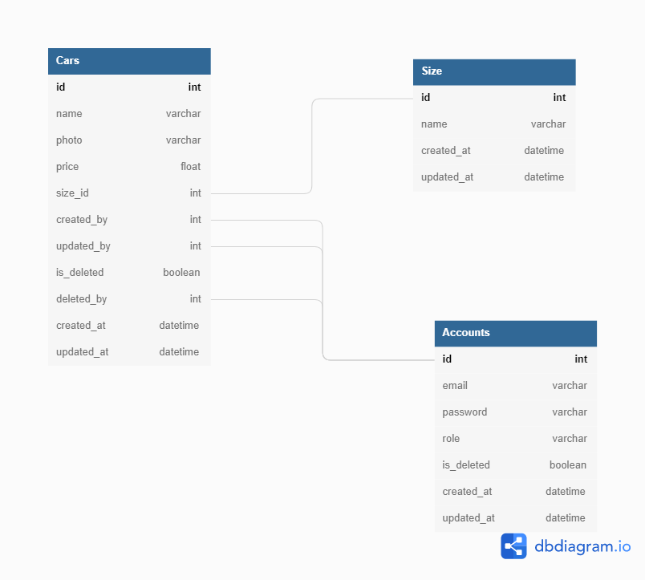

# Car Management API 🔥

Car Management API (Backend Only)

## 🚀Features

- ### Account Management ❗

```
  Create Account
  Read Account
  Read Account by id
  Update Account
  Delete Account (Soft Delete)
```

- ### Car Management 🚗

```
  Create Car
  Read list of Cars
  Read car by id
  Update Car
  Delete Car (Soft Delete)
```

- ### Login 👨‍✈️

```
  Login with Token
```

## 🏃How to Run (Installation)

```
yarn install
yarn sequelize-cli db:create
yarn migrate
yarn sequelize-cli db:seed:all
yarn start
```

## 🔍Endpoints

```
- /docs = API Documentation & testing
- /api/v1/login = Login
- /api/v1/admins = Post & Get Admin Account
- /api/v1/admins/:id = Get by id, Put, Delete(Soft Delete) Admin Account
- /api/v1/cars = Post & Get Car Data
- /api/v1/cars/:id = Get by id, Put, Delete(Soft Delete) Car Data
- /api/v1/register = Post Member Account
- /api/v1/profile = Get current login account
```

## ⭐Tech

| Package            | Version | Source                                                  |
| ------------------ | ------- | ------------------------------------------------------- |
| bcrypt             | ^5.0.1  | https://www.npmjs.com/package/bcrypt                    |
| express            | ^3.1.7  | https://expressjs.com/                                  |
| cors               | ^2.8.5  | https://expressjs.com/en/resources/middleware/cors.html |
| jsonwebtoken       | ^8.5.1  | https://jwt.io/                                         |
| pg                 | ^8.7.3  | https://yarnpkg.com/package/pg                          |
| pg-hstore          | ^2.3.4  | https://yarnpkg.com/package/pg-hstore                   |
| sequelize          | ^6.19.0 | https://sequelize.org/                                  |
| sequelize-cli      | ^6.4.1  | https://yarnpkg.com/package/sequelize-cli               |
| swagger-ui-express | ^4.4.0  | https://www.npmjs.com/package/swagger-ui-express        |

## 📌Entity Relationship Diagram


